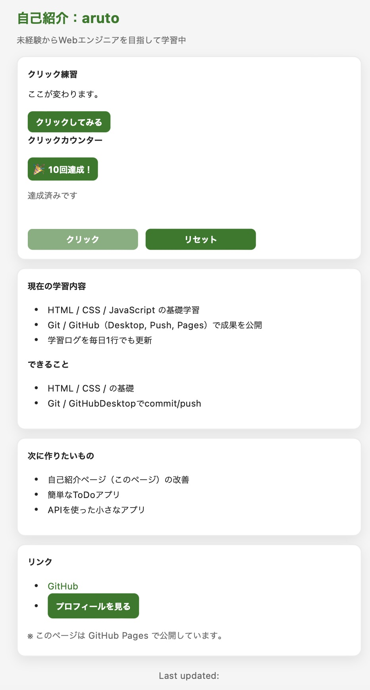

# Click Counter

## Author
岡本　光冬（オカモト　アルト/GitHub:aruto-nick）

## アプリ画面

## 概要
クリックしてカウントを増やし、目標回数達成を目指すカウンターアプリです。  
状態管理・自動保存機能・不正値対策を実装し、小規模ながら実務を意識した設計を行いました。

## URL
- Demo: https://aruto-nick.github.io/click-counter/
- Repository: https://github.com/aruto-nick/click-counter

## 使用技術
- HTML
- CSS
- JavaScript（Vanilla JS）
- Web Storage API（localStorage）

## 機能
- カウント機能
- 目標到達判定（GOAL: 10）
- 到達目前表示（NEAR_GOAL: 5）
- 自動保存機能（localStorage）
- 保存ステータス表示
- 不正値対策（Number.isNaN使用）
- タイマー多重実行対策（clearTimeout）

## 工夫した点

### 状態管理の分離
`getAppState()` でアプリ全体の状態を集約し、
`isGoalReached()` で判定ロジックを分離しました。

### 安全なデータ読み込み
`loadCount()` 内で `Number.isNaN` を使用し、
不正値の場合は 0 にリセットする設計にしました。

### タイマー競合対策
`saveStatusTimerId` を保持し、
`clearTimeout` により連打時の多重実行を防止しました。
表示処理は `showAutoSaveStatus()` に分離しています。

## ディレクトリ構成
- index.html
- style.css
- script.js

## 今後の改善案
- UIの改善（レスポンシブ対応）
- GOAL値の動的変更機能
- テスト導入

## 学んだこと

- 状態管理とUI更新処理の分離
- localStorageを用いたデータ永続化
- 不正値（NaN）対策の重要性
- タイマー多重実行の防止